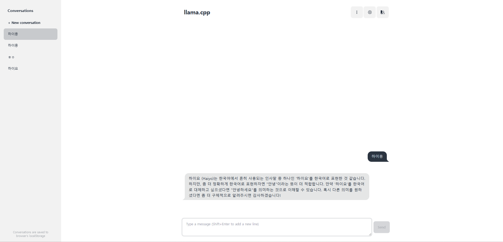

# llm-server
 - 미리 빌드된 llama.cpp 도커이미지를 가져와서 빠르게 모델 배포

# 사용방법
## 1. 모델 준비
- 모델 준비 후 models 폴더에 가중치파일 넣기기. [EXAONE-3.5-2.4B-Instruct-GGUF(비상업용)](https://huggingface.co/bartowski/EXAONE-3.5-2.4B-Instruct-GGUF)
    - 예시로 EXAONE-3.5-2.4B-Instruct-Q2_K.gguf 사용함
    - [LG EXAONE](https://huggingface.co/LGAI-EXAONE/EXAONE-3.5-2.4B-Instruct)
    - GGUF 파일이란?
- [llama3 한국어 양자화](https://huggingface.co/zoomer75/llama-3.2-Korean-Bllossom-3B-Q4_K_M-GGUF)
- [phi-4(마이크로소프트 최신 모델)](https://huggingface.co/microsoft/phi-4)
- [허깅페이스 검색]()
- 모델 선택은 리소스에 따라, [벤치마크 성능](https://huggingface.co/spaces/open-llm-leaderboard/open_llm_leaderboard#/?params=0%2C3)에 따라 선택
- docker-compose.yml 수정

```yml
command: --model /models/{your_model_file}

```

## 2. 도커 빌드
```bash
docker compose -f docker-compose.yml up

# GPU 사용 시
docker compose -f docker-compose-gpu.yml up

```

## 3. 사용

- localhost:8080 화면

-  Post 요청 보내기 http://localhost:8080/v1/chat/completions
```json
# 요청
{
    "messages": [
        {
            "role": "user",
            "content": "안녕"
        }
    ],
    "temperature": 0.7,
    "stream": false
}

# 답변
{
    "choices": [
        {
            "finish_reason": "stop",
            "index": 0,
            "message": {
                "content": "안녕하세요! 😊 어떻게 도움이 필요하신지 자세히 알려주시면 더 효과적으로 도와드릴 수 있을 것 같아요. 여행 계획, 요리 레시피 찾기, 일상 생활 팁 등 다양한 주제에 대해 궁금한 점이 있으신가요? 좀 더 자세히 알려주시면 감사하겠습니다! 😊",
                "role": "assistant"
            }
        }
    ],
    "created": 1736491685,
    "model": "gpt-3.5-turbo",
    "system_fingerprint": "b4457-ee7136c6",
    "object": "chat.completion",
    "usage": {
        "completion_tokens": 70,
        "prompt_tokens": 13,
        "total_tokens": 83
    },
    "id": "chatcmpl-LzyEZti4WO7NgXoMVnqSFz1xRTl0v2AA",
    "timings": {
        "prompt_n": 13,
        "prompt_ms": 108.351,
        "prompt_per_token_ms": 8.334692307692308,
        "prompt_per_second": 119.98043396000037,
        "predicted_n": 70,
        "predicted_ms": 2624.675,
        "predicted_per_token_ms": 37.495357142857145,
        "predicted_per_second": 26.66996866278682
    }
}
```

# Reference
[llama.cpp 깃허브](https://github.com/ggerganov/llama.cpp/tree/master)